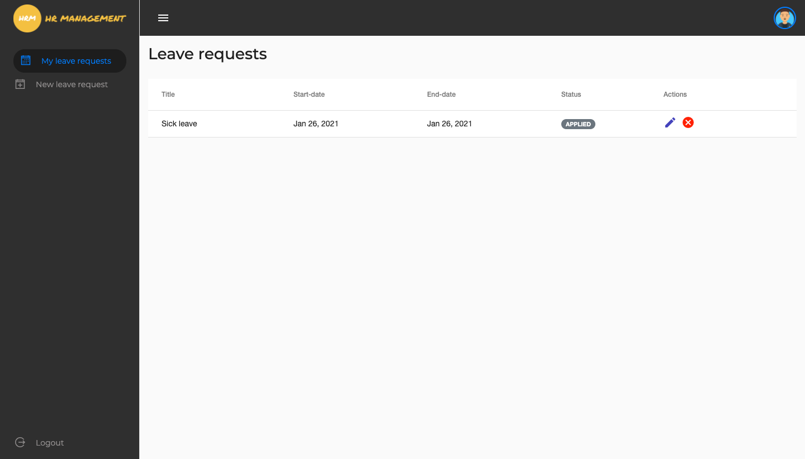

# HR Management Webapp

This project was generated with [Angular CLI](https://github.com/angular/angular-cli) version 10.1.2.

## Development server

Run `ng serve` for a dev server. Navigate to `http://localhost:4200/`. The app will automatically reload if you change any of the source files.

## About

This project deals with managing HRs, employees and their leaves.

- HR can manage employees, leave request, view summary of leaves by employees.
- Employees can apply or cancel the leave requests.

The webapp is made completely responsive for all desktop, tablet and mobile devices.

## Screenshots

